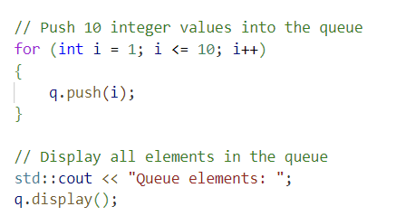
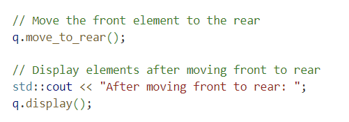
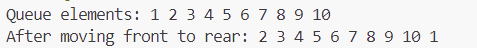
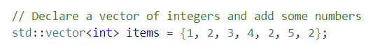
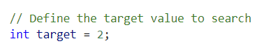
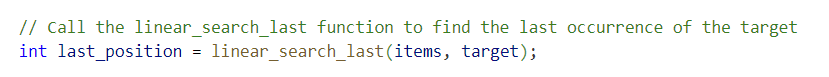
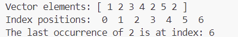
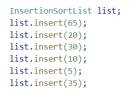
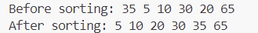

# Assignment 3

## Q1. Queue Implementation

### Overview

This project implements a generic `Queue` data structure in C++ using linked list nodes. The `Queue` class supports the following functions:
- `push()`: Adds an element to the rear of the queue.
- `pop()`: Removes the front element from the queue.
- `front()`: Retrieves the front element without removing it.
- `size()`: Returns the current size of the queue.
- `empty()`: Checks if the queue is empty.
- `move_to_rear()`: Moves the front element to the rear of the queue.

### Files

- `Queue.hpp`: Header file containing the `Queue` class template and function declarations.
- `Queue.cpp`: 
  - Implementation file containing the function definitions.
  - Test file that demonstrates the use of the queue functions.

### How to Run the Code

1. Ensure that you have all three files (`Queue.hpp`, `Queue.cpp`) in the same directory.
2. Compile the code using a C++ compiler (e.g., `g++`):
   ```bash
   g++ Queue.cpp Queue.cpp -o Queue
   ```
3. Run the compiled executable:
   ```bash
   ./Queue
   ```

### Expected Output

When you run the code, you should see output similar to the following:

```plaintext
Queue elements: 1 2 3 4 5 6 7 8 9 10 
After moving front to rear: 2 3 4 5 6 7 8 9 10 1
```

### Explanation

1. Queue elements: This line shows the initial state of the queue after pushing 10 integer values (1 to 10).
   
   

2. After moving front to rear: This line displays the queue after the move_to_rear() function has moved the front element (1) to the rear of the queue.
   
   

### Screenshot



### Additional Information

The Queue class is templated, so it can handle any data type (e.g., integers, floats, strings) by instantiating Queue<T> with the desired type.

## Q2. Recursive Linear Search - Last Occurrence Finder

This project provides a recursive function to perform a linear search in a vector and find the last occurrence of a target value. The code also includes a utility function to print the elements of the vector, making it easier to verify the contents of the vector before searching.

### Files

- LinearSearchLast.hpp: Header file containing declarations for the recursive search function and the vector printing function.
- LinearSearchLast.cpp: Source file implementing the recursive search function, the vector printing function, and a main function demonstrating their usage.

### How to Run the Code

1. Ensure that you have all three files (`Queue.hpp`, `Queue.cpp`) in the same directory.
2. Compile the code using a C++ compiler (e.g., `g++`):
   ```bash
   g++ LinearSearchLast.cpp Queue.cpp -o LinearSearchLast
   ```
3. Run the compiled executable:
   ```bash
   ./LinearSearchLast
   ```

### Expected Output

The vector elements and their indices will be displayed before the search result.
The output will look similar to the following:

```yaml
Vector elements: [ 1 2 3 4 2 5 2 ]
Index positions:  0  1  2  3  4  5  6 

The last occurrence of 2 is at index: 6
```

### Explanation

1. Vector elements: This line shows the initial state of the queue after pushing integer values.

   

2. Target integer:

   

3. Find last position of target:
   
   

### Screenshot



## Q3. Insertion Sort Linked List

This project implements an insertion sort algorithm on a linked list in C++. The `InsertionSortList` class supports adding elements to a linked list and then sorting them in ascending order using the insertion sort technique.

### Files

- `InsertionSortList.hpp`: Header file containing the class definitions and member function declarations for the `InsertionSortList` and `ListNode` structures.
- `InsertionSortList.cpp`: Implementation file with the actual logic for list insertion, sorting, and printing, as well as a main function to demonstrate the functionality.

### How to Run the Code

1. Compilation: Ensure you have a C++ compiler (such as `g++`). To compile the files, run:

   ```bash
   g++ InsertionSortList.cpp -o InsertionSortList
   ```

2. Execution: After compiling, execute the program:
   
   ```bash
   ./InsertionSortList
   ```

### Expected Output

The program will output the elements of the linked list before and after sorting:

```plaintext
Before sorting: 35 5 10 30 20 65 
After sorting: 5 10 20 30 35 65 
```

### Explanation

1. insert(int value): Adds a new node to the head of the list. This allows us to populate the list in reverse order.
   
   

2. sort(): Sorts the linked list using insertion sort. It iteratively removes nodes from the unsorted portion of the list and inserts them into the correct position in a new, sorted list.

3. printList(): Prints each value in the list to standard output, allowing us to observe the list order before and after sorting.

### Screenshot

