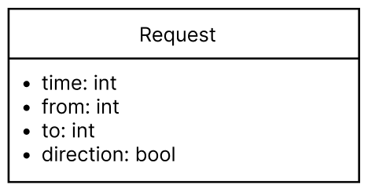
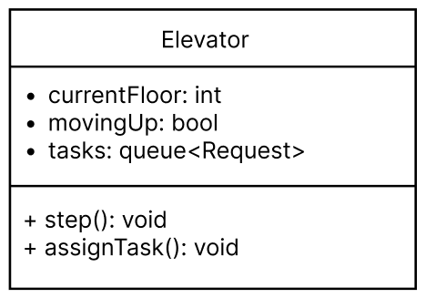
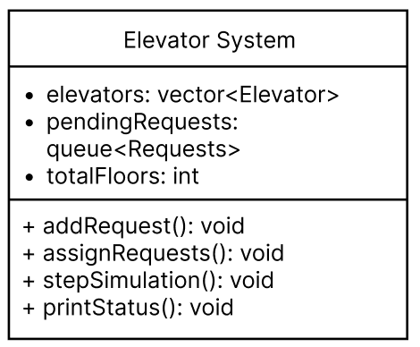

# Elevator System Simulation Report

## Assumptions

While designing the elevator system, the following assumptions were made:

1. Single and Multi-Elevator Systems: The algorithm is designed to handle both single and multiple elevators efficiently.

2. Request Timing: Requests are generated randomly with a probability to simulate real-world usage patterns.

3. Direction Consistency: Elevators continue in their current direction unless there are no requests in that direction.

4. Floor Numbers: Floors are indexed from 0 to (total number of floors - 1).

5. Immediate Assignment: Requests are assigned to elevators at the moment they are generated, and unassignable requests are re-evaluated periodically.

These assumptions ensure that the simulation remains simple yet realistic, balancing computational efficiency and real-world applicability.

## Goals

### 1. Efficient Request Handling

- Problem Definition: The system needs to handle multiple user requests efficiently and minimize wait times.

- Algorithm Design:

  - Optimal Elevator Selection: Requests are assigned to the nearest elevator, prioritizing those moving in the same direction as the request.

  - Pending Request Management: Requests that cannot be immediately processed are queued for reassignment.

This approach mirrors the Minimum Distance First strategy used in real-world elevators.

### 2. Simplicity and Scalability

- Support for Single and Multi-Elevator Systems: The system is designed to handle scenarios with one or more elevators.

- Clear Structure: The separation of responsibilities in the Elevator and ElevatorSystem classes simplifies maintenance and future enhancements.

### 3. Realistic Request Processing

- Time-Based Simulation: Randomized requests simulate realistic usage patterns.

- Request Flow: Each request includes a starting floor (from) and a destination floor (to), and the system outputs the status during processing.

### 4. Priority Handling and Wait Time Minimization

- Priority Processing: Requests matching the current direction of an elevator are processed first.

- Wait Time Reduction: The system minimizes unnecessary movement by prioritizing nearby requests.

### 5. Readability and Learning

- Readable Code: The structure is designed to be intuitive and easy to follow.

- Learning-Oriented: The system provides a straightforward implementation of an elevator simulation for educational purposes.

### 6. Real-World Similarity

- The algorithm emulates the decision-making processes of real-world elevators:

  - Maintains direction consistency.

  - Prioritizes closer requests.

## UML Class Diagram

Below is a simplified UML class diagram representing the structure of the elevator system:







## Efficiency of Algorithms

### Significant Functions

1. addRequest

   - Description: Adds a new request to the system's pending request queue.

   - Complexity: O(1) (simple insertion into the queue).

2. assignRequests

   - Description: Assigns pending requests to the most suitable elevator based on proximity and direction.

   - Complexity: O(n * m), where n is the number of pending requests and m is the number of elevators. This is because each request is compared against all elevators to find the best match.

   - Possible Improvement: Using a priority queue or a more advanced data structure to maintain elevators' availability and proximity could potentially reduce the cost to O(n log m).

3. stepSimulation

   - Description: Updates the state of all elevators, processes requests, and moves elevators to their next floor.

   - Complexity: O(k), where k is the number of elevators (each elevator processes at most one task per step).

4. printStatus

   - Description: Outputs the current status of all elevators.

   - Complexity: O(k), where k is the number of elevators.

### Overall Complexity

The dominant cost arises from the assignRequests function due to its O(n * m) complexity. This could be further optimized with additional data structures, as noted above.

## Simulation Design

### 1. Random Request Generation

- Requests are generated randomly using rand().

- Request generation probability is adjusted to prevent excessive loads.

### 2. Time-Based Processing

- The simulation advances in discrete time steps (t), performing the following tasks:

  1. Generate new requests.

  2. Assign requests to elevators.

  3. Update elevator states.

  4. Output system status.

### 3. Output

Below is an example of the system's output during execution:

```
Time: 0
Elevator 1: Floor 0
Elevator 2: Floor 0
Elevator 3: Floor 0
=====================
Time: 1
Elevator 1: Floor 0
Elevator 2: Floor 0
Elevator 3: Floor 0
=====================
Time: 2
Elevator 1: Floor 0
Elevator 2: Floor 0
Elevator 3: Floor 0
=====================
Time: 5
Elevator 1: Floor 1 -> Next: Floor 4
Elevator 2: Floor 0
Elevator 3: Floor 0
=====================
Time: 7
Elevator 1: Floor 4
Elevator 2: Floor 0
Elevator 3: Floor 0
=====================
```

## References

1. C++ Standard Library Documentation: Utilized for understanding the behavior of STL containers like std::queue and std::vector.

2. Elevator Algorithms: General principles of elevator operation were referenced from Wikipedia.

3. Real-world Elevator Systems: Observations from the functional behavior of elevators in real-life scenarios.